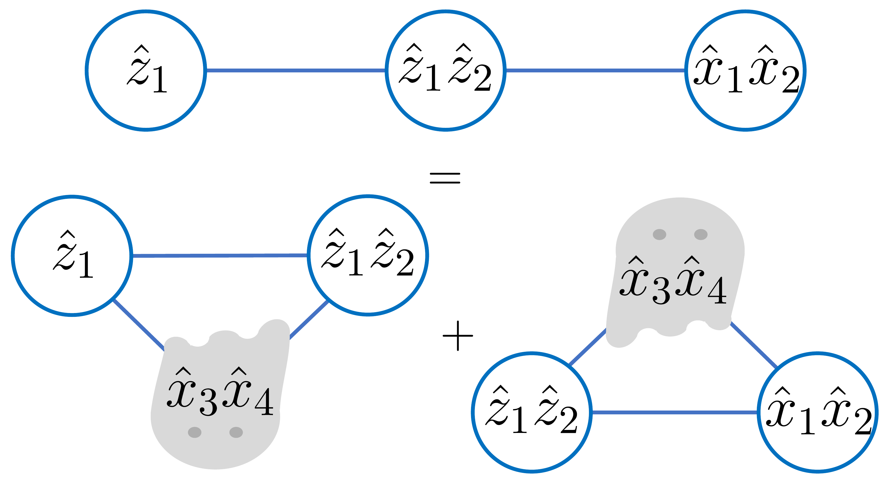
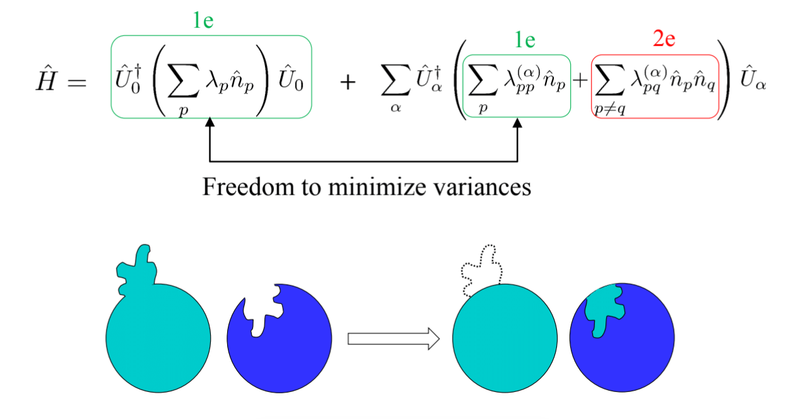

# Measurement Optimization

This section of the tutorial provides simple step-by-step guides for using state-of-the-art 
measurement optimization techniques within Tequila. These optimization techniques were shown \[[1](#qubit-methods-in-tequila)&ndash;[6](#fermionic-methods-in-tequila)\] to significantly reduce the number of measurements required to obtain the observable expectation value (e.g., that of molecular electronic Hamiltonian) in near-term quantum algorithms (e.g., variational quantum eigensolver). Optimization methods implemented in Tequila can be divided into two categories based on the employed algebra: [qubit operator](./QubitMethods.ipynb) \[[1](#qubit-methods-in-tequila)&ndash;[4](#qubit-methods-in-tequila)\] and [fermionic operator](./FermionicMethods.ipynb) \[[5](#fermionic-methods-in-tequila), [6](#fermionic-methods-in-tequila)\] algebras. Both types of methods use a classically efficient proxy (e.g., Hartree&ndash;Fock or configuration interaction singles and doubles wavefunction) to the quantum wavefunction to lower the measurement requirements. 

[Here](https://t.co/caToVdQydZ) is a small video that summarizes most of the recent advances.

## Qubit-algebra-based methods &mdash; Tutorial

Our tutorial on how to use qubit-algebra-based measurement optimization techniques in Tequila can be found [here](./QubitMethods.ipynb).

#### Qubit methods in Tequila

Tequila features three qubit-algebra-based measurement optimization techniques:\
[1] Minimum Clique Cover (LF, RLF): [J. Chem. Phys. 152, 124114 (2020)](https://aip.scitation.org/doi/pdf/10.1063/1.5141458).\
[2] Sorted insertion (SI): [Quantum **5**, 385 (2021)](https://doi.org/10.22331/q-2021-01-20-385).\
[3] Iterative coefficient splitting (ICS): [npj Quantum Inf. **9**, 14 (2023)](https://www.nature.com/articles/s41534-023-00683-y).

Among the qubit-algebra-based methods, ICS has the lowest required number of measurements. A more recently developed ghost Pauli product method with an even lower measurement requirement will soon be added to Tequila. The ghost Pauli product method is presented in:\
[4] Ghost Pauli product: [J. Chem. Theory Comput. **18**, 7394 (2022)](https://pubs.acs.org/doi/full/10.1021/acs.jctc.2c00837)

## Fermionic-algebra-based methods &mdash; Tutorial

Our tutorial on how to use fermionic-algebra-based methods can be found [here](./FermionicMethods.ipynb) .

#### Fermionic methods in Tequila

Tequila features two fermionic-algebra-based measurement optimization techniques:\
[5] Low rank (LR) decomposition [npj Quantum Inf. **7**, 23 (2021)](https://www.nature.com/articles/s41534-020-00341-7); [PRX Quantum **2**, 040320 (2021)](https://journals.aps.org/prxquantum/abstract/10.1103/PRXQuantum.2.040320).\
[6] Fluid fermionic fragments [Quantum **7**, 889 (2023)](https://quantum-journal.org/papers/q-2023-01-03-889/pdf/).
